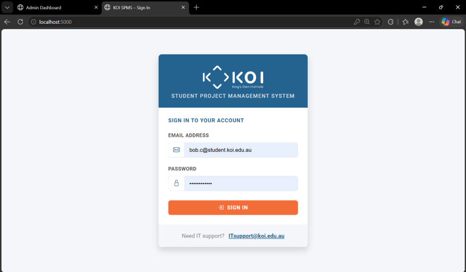
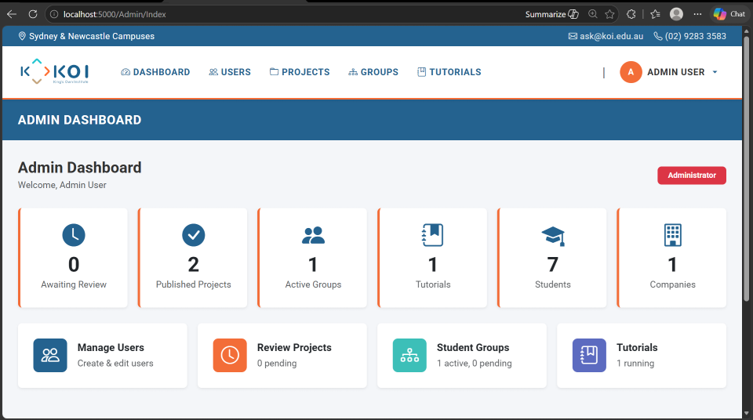
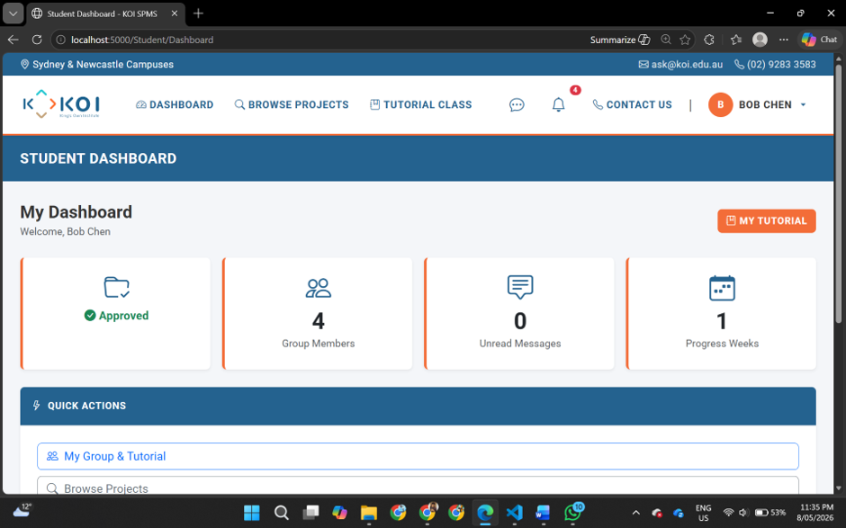
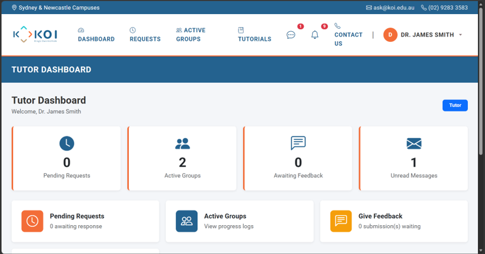
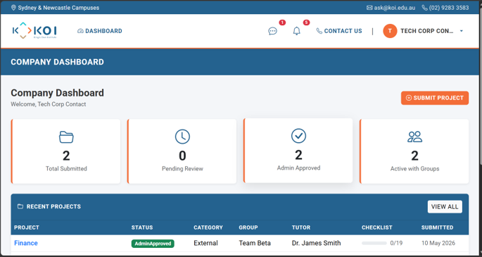
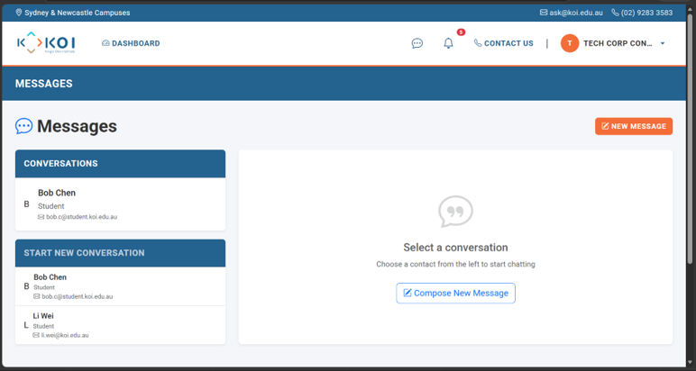

# Student Project Management System (SPMS)

A web-based Student Project Management System (SPMS) developed using ASP.NET Core MVC and MySQL to streamline project allocation, communication, and progress tracking between students, tutors, companies, and administrators.

---

## Overview

The Student Project Management System (SPMS) is designed to simplify the management of academic projects by providing a centralized platform for project submission, approval, communication, and monitoring.

The system supports four different user roles with dedicated dashboards and permissions.

---
## Project Highlights

- Four user roles with dedicated dashboards
- Secure authentication and authorization
- Project allocation and approval workflow
- Internal messaging system
- Notification management
- Weekly progress tracking
- Responsive Bootstrap interface

## Features

### Administrator

- User Management
- Tutorial Management
- Project Management
- Group Management
- Project Approval
- Notification Management

### Student

- Browse Available Projects
- Submit Project Preferences
- View Assigned Projects
- Weekly Progress Submission
- Messaging
- Notifications

### Tutor

- Manage Tutorial Groups
- Approve Student Requests
- Monitor Weekly Progress
- Messaging
- Notifications

### Company

- Submit Industry Projects
- Edit Projects
- Track Student Groups
- Messaging

---

## User Roles

- Admin
- Student
- Tutor
- Company

---

## Technology Stack

| Technology | Description |
|------------|-------------|
| ASP.NET Core MVC | Web Framework |
| C# | Backend Programming |
| Entity Framework Core | ORM |
| MySQL | Database |
| Bootstrap 5 | Frontend Framework |
| HTML/CSS | UI Design |
| JavaScript | Client-side Scripting |

---

## System Modules

- Authentication
- User Management
- Tutorial Management
- Project Management
- Group Allocation
- Messaging System
- Notification System
- Weekly Progress Tracking

---

## Installation

### Clone Repository

```bash
git clone https://github.com/azizulrabbi/Student-Project-Management-System.git
```

### Open Project

Open the project using Visual Studio 2022.

### Database

Create a MySQL database named:

```
spms_db
```

Update the connection string inside:

```
appsettings.json
```

Run database migration or execute the provided SQL script.

---

## Project Structure

```
Controllers/
Data/
Helpers/
Models/
Views/
wwwroot/
Program.cs
```
# Student Project Management System (SPMS)


---

## Screenshots

### Login Page


### Admin Dashboard


### Student Dashboard


### Tutor Dashboard


### Company Dashboard


### Messaging Module

---

## Future Improvements

- Email Notifications
- File Upload Validation
- Real-time Chat
- Mobile Responsive Improvements
- Dashboard Analytics
---

## Contributors

Developed as part of the ICT302 Information Technology Project 2 at King's Own Institute (KOI).

Project developed by a student team under academic supervision.

---

## License

This project was developed as part of the ICT302 Information Technology Project 2 course at King's Own Institute (KOI) and is intended for educational and portfolio purposes.